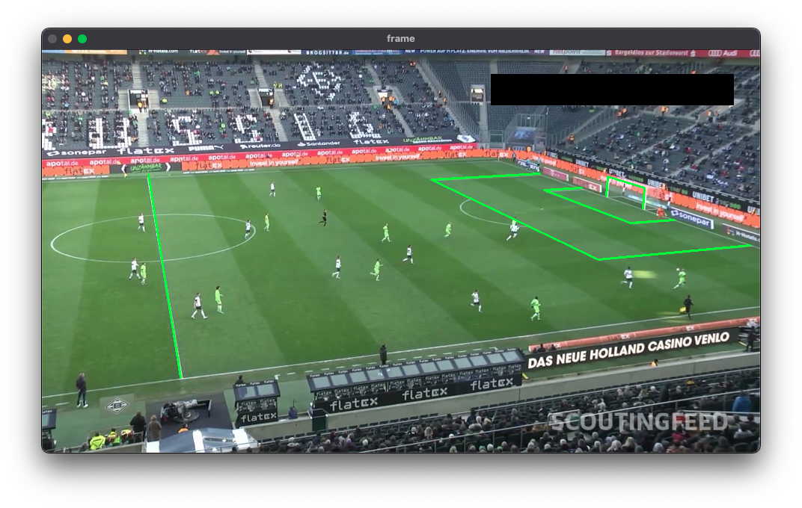

# ⚽️ Football Video AI Analyzer

简体中文｜[English](README_EN.md)

目前该项目为研究/学习级产品，用于跟踪足球比赛中的人和球，并识别出守门员、计算威胁程度，用于最终自动生成守门员处理球集锦（未实现）。

<div align="center">
<figure>
    
    <figcaption><em>总体效果</em></figcaption>
</figure>
</div>

## 功能

### I. 球场识别与拟合

`core/pnl`

采用了 [PnLCalib](https://arxiv.org/abs/2404.08401) 的方法:
1. 使用 keypoint 模型检测关键点并使用 line detection 模型辅助检测
2. 使用 FramebyFrameCalib 进行相机标定和优化


### II. 球员识别跟踪

`core/player_tracker.py`


1. 通过 Object Detection Model 进行球员/裁判分类

2. 用 BoT-SORT 进行跟踪，会自动处理 GMC, ReId, Kalman Filter

(3.) 计划通过位置特征 (目前仅依靠x、y坐标) 识别守门员候选人

### III. 足球识别跟踪

`core/ball_tracker.py`

<div align="center">
<figure>
    
    <figcaption><em>如图，红色为模型检测，蓝色为滤波处理后结果</em></figcaption>
</figure>
</div>

1. 通过前面得到的H，将所有足球放到BEV坐标系中
2. 计算所有检测点距离之前球轨迹的 Mahalanobis Distance
3. 使用 Chi Square 判断检测是否有效，选出最优的检测
4. 用 Kalman Filter 预测，用于平滑化轨迹以及防止阻挡带来的问题

---

## 如何启动？

> 测试比赛视频已内置于 `input_vids/` 中

1. 训练模型：从 [roboflow](https://universe.roboflow.com/roboflow-jvuqo/football-players-detection-3zvbc) 
下载数据集并训练（演示使用的是 YOLO11）。训练好的权重文件放入 `weights` 文件夹，并在 `main.py` 中更改权重文件的路径
1. 安装依赖：
   ```bash
   pip install -r requirements.txt
   ```

1. 将模型文件放入 `models/`, 将比赛视频放入 `input_vids/` 
1. 在 main.py 中修改 `model` 和 `VIDEO_PATH` 为你的文件路径
1. 运行 main.py，弹出 cam视角、bev视角 窗口

---

## TODO


更详细的问题列表位于 [problems.md](docs/problems.md)

- [ ] 自动生成守门员处理球集锦
- [ ] 威胁度评分（结合位置、球速、对方球员密度等特征）
- [ ] 守门员姿态分析、运动速度轨迹分析
- [ ] 沉浸式看球（？）VR/gaming

---

## 参考

### 球场检测
- SoccerNet Calibration: https://github.com/SoccerNet/sn-calibration
- PnLCalib: https://arxiv.org/abs/2404.08401

### 数据处理与分析
- SoccermaticsForPython: https://github.com/Friends-of-Tracking-Data-FoTD/SoccermaticsForPython
- Friends of Tracking: https://www.youtube.com/@friendsoftracking755
- wyscout: https://apidocs.wyscout.com?version=3

---

## 🤝 贡献与联系

欢迎提交 issues 或 PR，亦可通过 hungryhenry101@outlook.com 进行联系