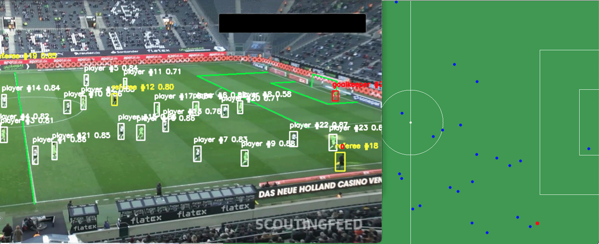
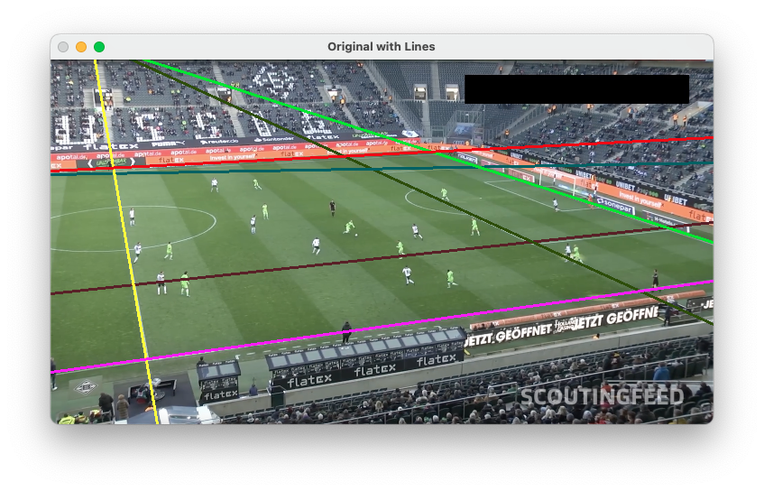
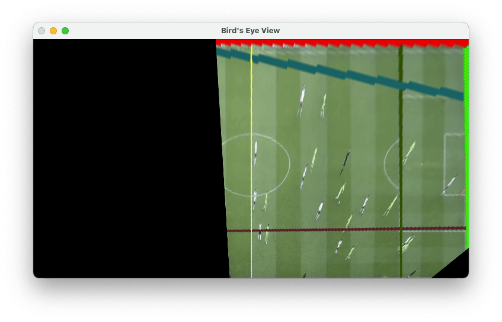
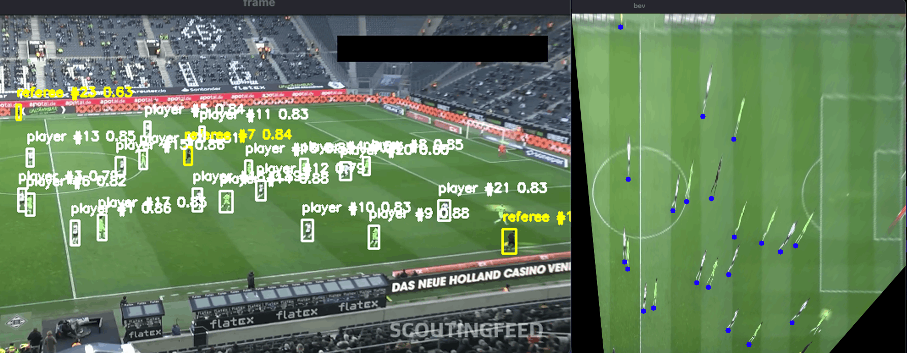
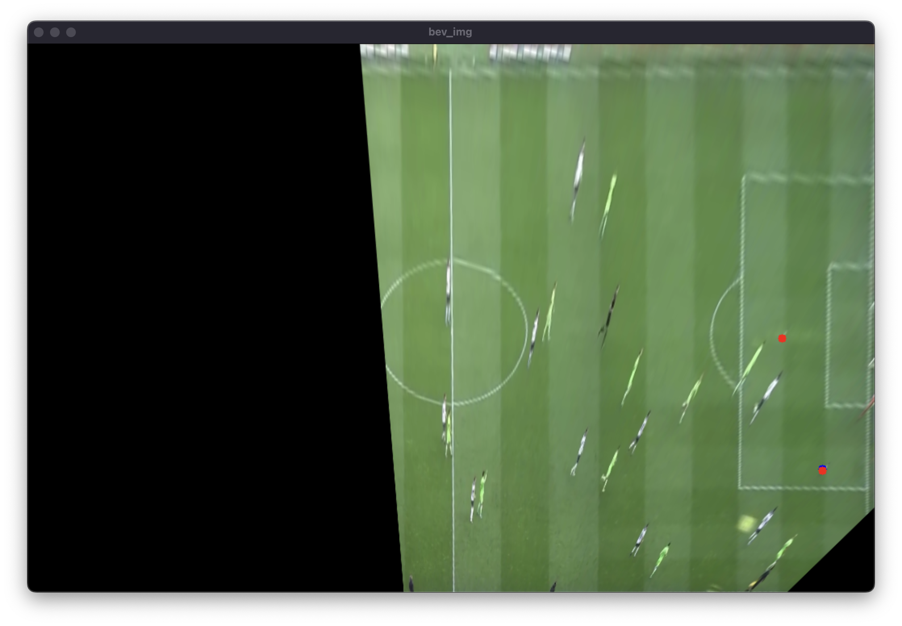
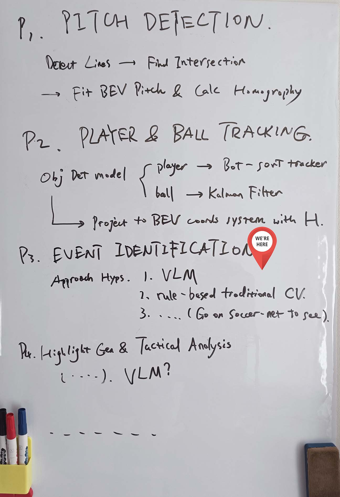

# ⚽️ Football Video AI Analyzer

[简体中文](README.md) ｜ English

This project is currently a research/learning prototype designed to track players and the ball in football match videos. It identifies goalkeepers, calculates threat levels, and aims to automatically generate goalkeeper highlight reels (not yet implemented).

<div align="center">
<figure>
    
    <figcaption><em>Overall Visual Output</em></figcaption>
</figure>
</div>

## Features

### I. Pitch Line Detection and Standard Pitch Fitting

`core/pitch_detection`

1. Uses a semantic segmentation model to detect and classify pitch lines (future plans include removing dependency on model-based classification, potentially using Hough Transform).


2. Calculates the Homography based on predefined pitch line configurations to fit the standard pitch (and generates a Bird's Eye View).


### II. Player Detection and Tracking

`core/player_tracker.py`



1. Uses an Object Detection Model to classify players/referees.

2. Tracks objects using trackers (e.g. ByteTrack), automatically handling CMC (Camera Motion Compensation), ReID, and Kalman Filtering.

3. Plans to identify goalkeeper candidates based on spatial features (currently only using x, y coordinates).

### III. Ball Detection and Tracking

`core/ball_tracker.py`

<div align="center">
<figure>
    
    <figcaption><em>Red denotes raw model detections, Blue denotes filtered trajectory.</em></figcaption>
</figure>
</div>

1. Maps all ball detections to the Bird's Eye View (BEV) coordinate system using the homography matrix H.
2. Calculates the Mahalanobis Distance from all detected points to the previous ball trajectory.
3. Uses Chi-Square testing to validate detections and select the best candidate.
4. Smooths the trajectory and handles occlusions using a Kalman Filter.

---

## TODO



- [ ] Automatically generate goalkeeper highlight reels
- [ ] Threat level rating (combining location, ball speed, opponent density, etc.)
- [ ] Goalkeeper pose analysis and velocity trajectory analysis
- [ ] Immersive viewing (?) VR/gaming

---

## Tech Stack and Dependencies

- Detection Model: [football-players-detection](https://universe.roboflow.com/roboflow-jvuqo/football-players-detection-3zvbcYOLOv11m) (YOLOv11m)
- Tracker: ByteTrack (configuration file `bytetrack.yaml`)
- Visualization: OpenCV
- Language: Python 3.10

Install dependencies:

```bash
pip install -r requirements.txt
```

---

## Quick Start

> Note: Download the model file [football-players-detection](https://universe.roboflow.com/roboflow-jvuqo/football-players-detection-3zvbcYOLOv11m), train your own, or download it from [Lanzou Cloud](https://wwbcc.lanzoup.com/iDH023f1y7zg).
> The test match video is included in `input_vids/`.

1. Place the model file in `models/` and the match video in `input_vids/`.
2. Update the `model` and `VIDEO_PATH` in `main.py` with your file paths.
3. Run `main.py`:
   ```bash
   python main.py
   ```
4. After processing:
   - Tracking logs are saved to `output/track_log.csv`.
   - Run `draw_2d.py` to view visualized trajectories, which will be saved as `output/track_trajectories.png`.

---

## 🤝 Contribution & Contact

Contributions via issues or PRs are welcome! You can also reach out via hungryhenry101@outlook.com.
